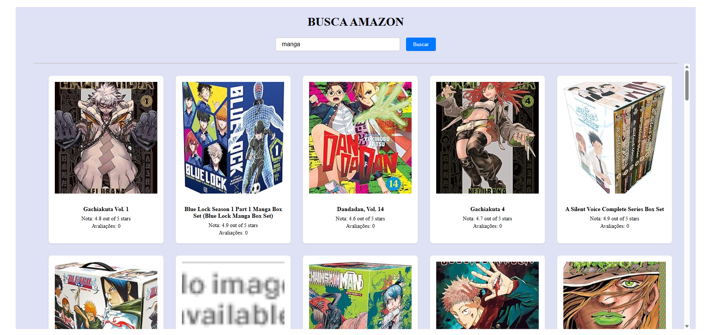

# 🛠️ Amazon Scraper

Este projeto é uma aplicação fullstack com frontend em **Vite + React + TypeScript** e backend em **Bun + Express + Puppeteer**. Ele permite buscar produtos na Amazon com base em uma palavra-chave fornecida, retornando título, nota, avaliações e imagem de cada item encontrado.

---

## 📁 Estrutura do Projeto

```bash
AmazonScraper/
│
├── backend/           # Backend em Bun + Express
│   └── index.ts
│
├── frontend/          # Frontend em Vite + React + TS
│   ├── src/
│   │   ├── components/
│   │   │   └── ProductList.tsx
│   │   └── App.tsx
│   └── vite.config.ts
│
├── package.json
└── README.md
```


## ✅ Funcionalidades

### 🔧 Backend (Bun + Express + Puppeteer)

- Cria um endpoint `/api/scrape` que:
  - Recebe uma `keyword` via query param.
  - Utiliza o Puppeteer para abrir o site da Amazon e buscar produtos.
  - Extrai título, nota, número de avaliações e imagem de cada produto.
  - Retorna um array com esses dados em JSON.

### 🎨 Frontend (Vite + React + TypeScript)

- Interface amigável com campo de busca.
- Faz requisição para o backend ao clicar em **"Buscar"**.
- Exibe os produtos encontrados em um layout em grid.
- Tratamento de erros e loading.

---

## 🚀 Como executar o projeto

### 📦 Clonando o repositório

```bash
git clone https://github.com/Josefs-stack/AmazonScraper.git
cd AmazonScraper
````

## 🧱 Backend (Bun + Express + Puppeteer)

###📋 Pré-requisitos

Bun instalado

Node.js 18+ (necessário para Puppeteer)

Chromium (baixado automaticamente com Puppeteer)

### 📥 Instalação

````bash
cd backend
bun install
````
### ▶️ Execução

````bash
bun index.ts
````
O servidor será iniciado em http://localhost:3000.

#@ 💅 Frontend (Vite + React + TypeScript)

### 📋 Pré-requisitos

Node.js

npm ou bun

### 📥 Instalação

````bash
cd frontend
bun install
````

### ▶️ Execução

````bash
bun run dev
````

A aplicação estará disponível em http://localhost:5173.

### ⚠️ Certifique-se de que o frontend pode se comunicar com http://localhost:3000/api/scrape.
Você pode configurar um proxy no vite.config.ts:

````ts
// vite.config.ts
export default defineConfig({
  server: {
    proxy: {
      '/api': 'http://localhost:3000',
    },
  },
});
````

## 📸 Screenshots
(adicione aqui sua imagem de busca com markdown)



## ⚠️ Avisos
A Amazon pode alterar o layout da página a qualquer momento, o que pode quebrar o scraper.

Evite fazer muitas requisições seguidas para não ser bloqueado pela Amazon.
